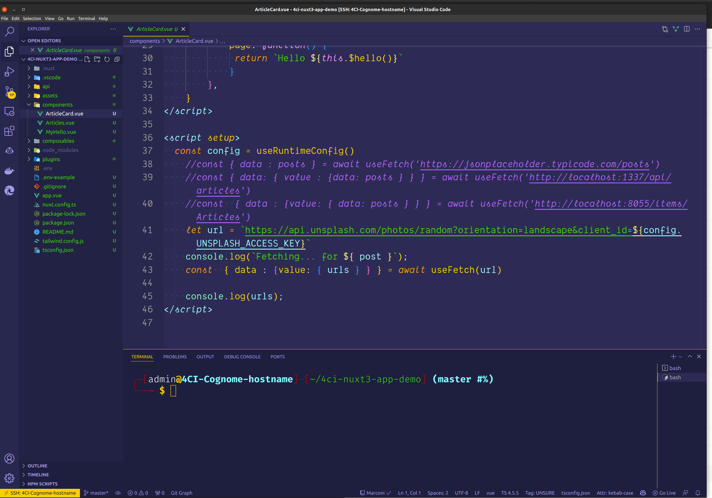

# Nuxt 3 app con interrogazione di servizi ReST

Dimostrazione di una web app che usa Nuxt 3 con interrogazione di servizi ReST


## Authors

- [@mlongano](https://github.com/mlongano)


## Features

- Tailwind css
- Esempio di composable
- Esempio di plugin
- Esempio di component
- Esempio di fetch da unsplash e jsonplaceholder


## Documentation

[Nuxt 3](https://v3.nuxtjs.org/)


## Lessons Learned

How to structure a basic Nuxt 3 project to consume ReST APIs

## Screenshots




## Installation

### Setup

Make sure to install the dependencies

```bash
yarn install
```

### Development

Start the development server on http://localhost:3000

```bash
yarn dev
```

## Environment Variables

To run this project, you will need to add the following environment variables to your `.env` file

`UNSPLASH_ACCESS_KEY="<YOUR-API-KEY>"`

[see unsplash documentation](https://unsplash.com/documentation)


## License

[](https://github.com/mlongano/4ci-nuxt3-app-demo/blob/main/LICENSE)
